---

**Deep Learning**

**Dozent: Prof. Dr. Felix Gers (Berliner Hochschule für Technik)**

**Studiengang Medieninformatik Online MA, Sommersemester 2022**

**University of Applied Sciences Emden/Leer, Faculty of Technology, Department of Electrical Engineering and
Informatics**

---

### Einsendeaufgabe EA3 : Regression Lernen mit feed-forward Neural Network (FFNN) als Model und TensorFlow.js (TFJS) als Framework/API.

Mit einem feed-forward neural Network (FFNN) soll eine Regression der reellwertigen Funktion: y(x) = (x+0.8) * (x-0.2) * (x-0.3) * (x-0.6) im Wertebereich [-1,+1] 
durchgeführt werden. 

Zum Erzeugen der Trainingsdaten sollen N zufällige, gleich-verteilte x Werte (mit N= 5, 10, 20, 50, 100) aus dem Intervall [-1,+1] (keine Normalverteilung für die x-Werte) erzeugt und dazu y(x) berechnet werden. Zum Verrauschen wird dem Funktionswert ein normal-verteiles Rauchen (Gaussian Noise) mit einer Varianz von entweder 0.1 oder 0.3 hinzugefügt. 

[zur Webseite](https://deep-learning.ckitte.de/ea3/)

## Umsetzung

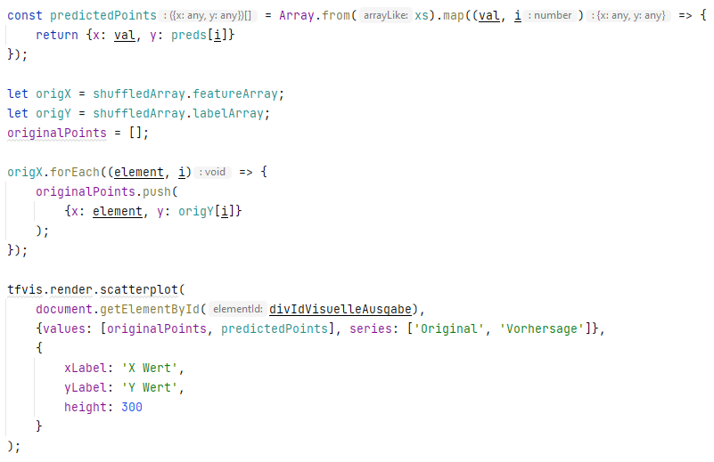

## Lösung

Jeweils das gleiche Dataset mit n= 100 DS und Nois mit Varianz von 0,3

17 Layer, 32 Units, ReLu, MSE, adamax (0,01), n=25/Batch, 200 Epochen

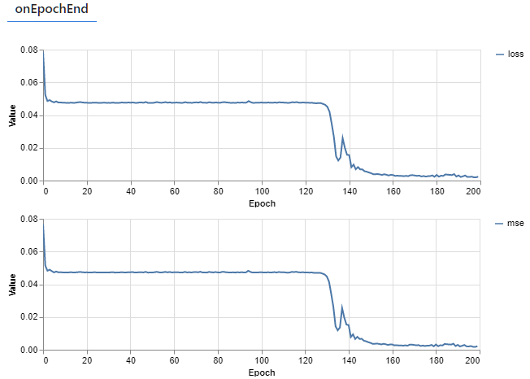

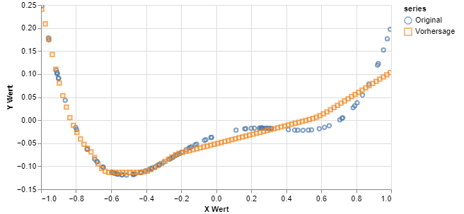

13 Layer, 32 Units, ReLu, MSE, adamax (0,01), n=25/Batch, 200 Epochen

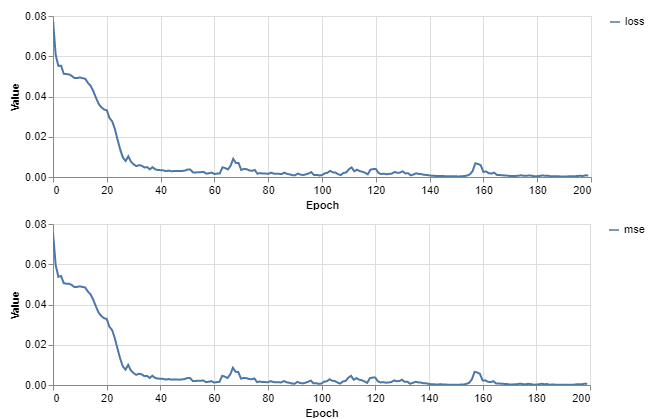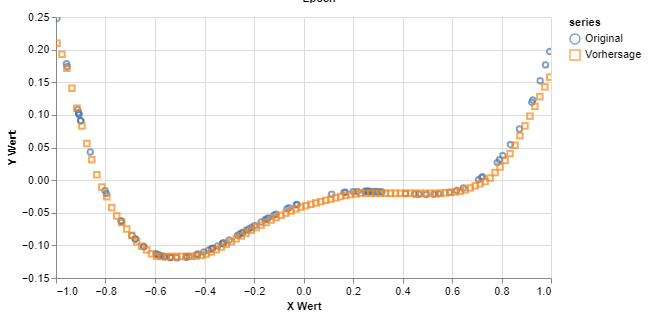

13 Layer, 32 Units, ReLu, MSE, adamax (0,01), n=50/Batch, 400 Epochen

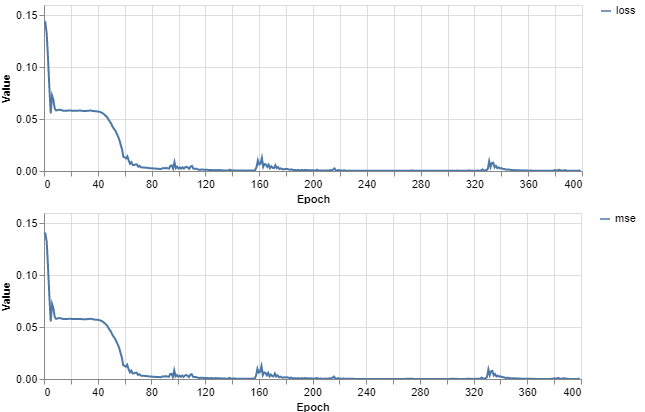

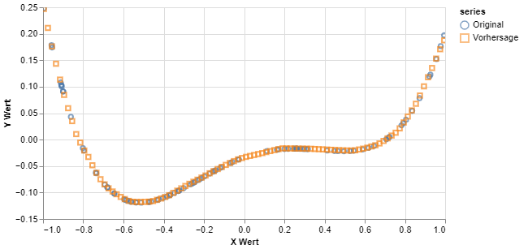

13 Layer, 32 Units, ReLu, MSE, adamax (0,01), n=5/Batch, 200 Epochen

13 Layer, 32 Units, ReLu, MSE, adamax (0,01), n=25/Batch, 404 Epochen

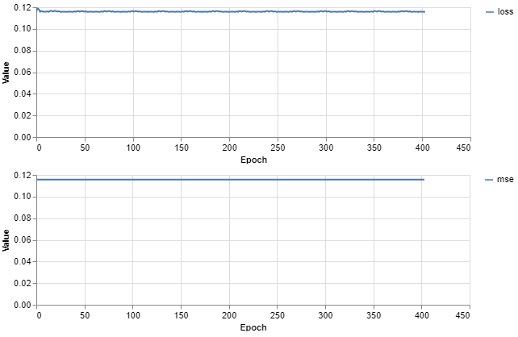

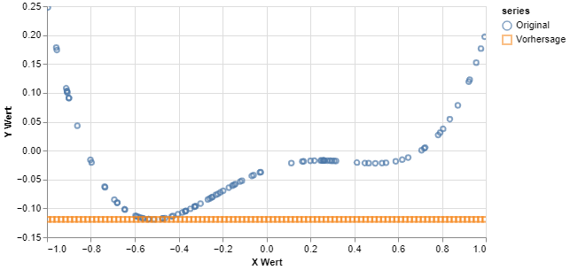

2 Layer, 32 Units, ReLu, MSE, adamax (0,01), n=25/Batch, 200 Epochen

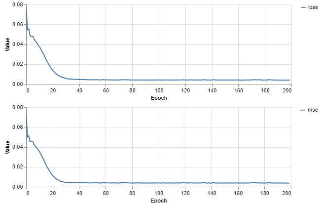

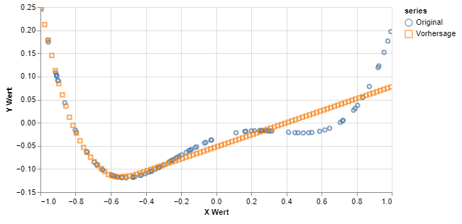

2 Layer, 10 Units, ReLu, MSE, adamax (0,01), n=25/Batch, 200 Epochen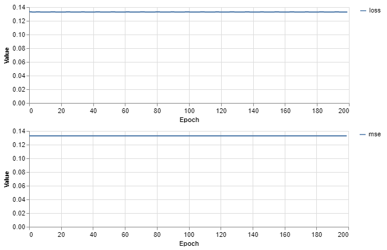

20 Layer, 50 Units, ReLu, MSE, adamax (0,01), n=100/Batch, 300 Epochen

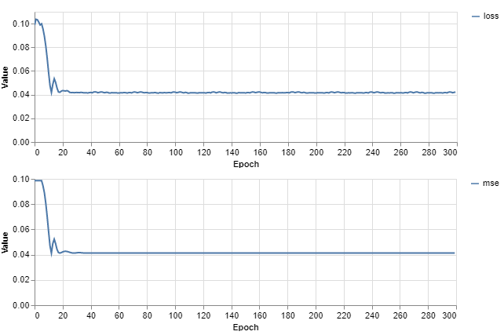

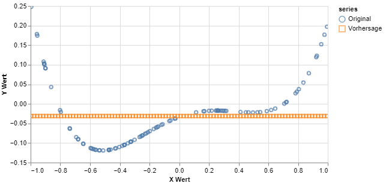

13 Layer, 32 Units, ReLu, MSE, adamax (0,01), n=1/Batch, 404 Epochen

Sehr langsam

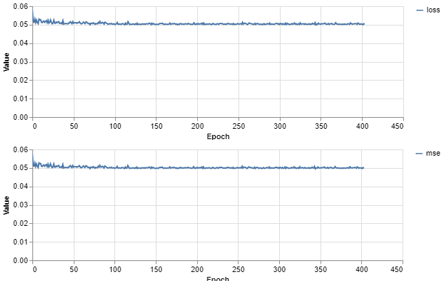

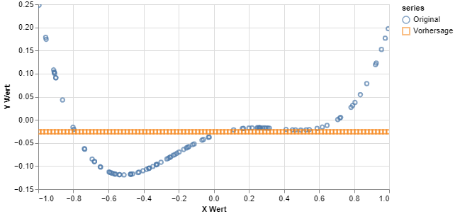

## Ergebnisse
