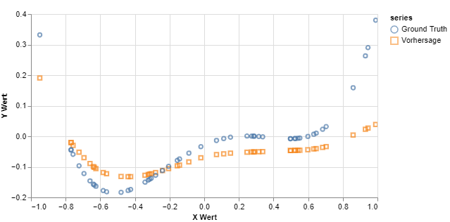

---

**Deep Learning**

**Dozent: Prof. Dr. Felix Gers (Berliner Hochschule für Technik)**

**Studiengang Medieninformatik Online MA, Sommersemester 2022**

**University of Applied Sciences Emden/Leer, Faculty of Technology, Department of Electrical Engineering and
Informatics**

---

### Einsendeaufgabe EA3 : Regression Lernen mit feed-forward Neural Network (FFNN) als Model und TensorFlow.js (TFJS) als Framework/API.

Mit einem Feed-Forward Neural Network (FFNN) soll eine Regression der reellwertigen Funktion: 

y(x) = (x+0.8) * (x-0.2) * (x-0.3) * (x-0.6) im Wertebereich [-1,+1] 

durchgeführt werden. 

Zum Erzeugen der Trainingsdaten sollen N zufällige, gleichverteilte Werte (mit N= 5, 10, 20, 50, 100) aus dem Intervall [-1,+1] (keine Normalverteilung) erzeugt und dazu der jeweilige Funktionswert berechnet werden. Zum Verrauschen wird dem Funktionswert ein normalverteiltes Rauchen (Gaussian Noise) mit einer Varianz von 0.3 hinzugefügt. 

[zur Webseite](https://deep-learning.ckitte.de/ea3/)

## Umsetzung

Bei der Umsetzung der Basis, insbesondere der zu nutzenden Daten und Funktion, wurde sich eng an die Vorgaben der Aufgabe gehalten und diese umgesetzt. In einer ersten Iteration wurden hierzu mit Hilfe von Online Generatoren die benötigten DataSets generiert und mit einem Rauschen angereichert. Diese sollten als Basis für die Experimente dienen. Primär aus zwei Gründen wurde dieser Ansatz verworfen: Zum einen würde man hierdurch immer mit den gleichen Daten arbeiten, zum anderen zeigten sich beim Laden und aufbereiten Geschwindigkeitsprobleme. Die letztlich umgesetzte Variante, alle Daten on the fly zu generieren erwies sich in der Folge als richtig. Die Methodik zur Berechnung wurde hierbei einer fremden Quelle entnommen.

Bezogen auf die Möglichkeiten der Anwendung existiert Spielraum und es wurden in der ersten Iteration nur die zur Umsetzung benötigten Funktionalitäten implementiert. Bei der späteren Arbeit mit der Anwendung konnten weitere nützliche Funktionen identifiziert und implementiert werden. Bei der Erstellung des Netzes wird auf die **Layer-API** von Tensorflow zurück gegriffen. Diese ist ähnlich der von Keras und sehr benutzerfreundlich. Daneben kann die sogenannte **Core-API** verwendet werden. Sie ist komplexer, bietet dafür aber wesentlich mehr Spielraum und Möglichkeiten. Trainings erfolgen in dieser Anwendung immer auf **Tensoren**, nicht auf **DataSets**.

## Lösung

Die hier vorliegende Lösung teilt sich auf zwei Reitern auf. Auf dem **linken Reiter** kann durch Auswahl die Zahl der zu verwendenden **Daten** ausgewählt werden. Diese werden bei jeder Auswahl **neu und zufällig generiert**. Anschließend wird ihnen ebenfalls mit jeweils neu generierten Zufallszahlen ein Gaußsches Rauschen mit einer Varianz von 0,3 hinzugefügt. 

Unabhängig von der durch Tensorflow durchgeführten und zufälligen Initialisierung der Anfangswerte der Parameter aka Gewichte im Modell führt dies dazu, das alleine schon hierdurch bei jedem Durchlauf mit neuen Datasets die Ergebnisse eine andere Form annehmen können.

Auf dem **zweiten Reiter** finden sich diverse Möglichkeiten für die **Einstellung, Nutzung und Speicherung  des zu erzeugenden FFNN**. Ganz oben auf der linken Seite des Reiters kann ein **vordefiniertes Netz ausgewählt werden**, dass einem über-, unter- oder gut angepassten Netz entspricht.

Darunter kann ein eigenes Netz definiert werden. Grundsätzlich werden **sequenzielle Netze** mit Dense Layern erstellt. **Dense Layer** haben die Eigenschaft, dass jedes Unit aka Neuron der vorhergehenden Schicht mit allen Units der nachfolgenden verbunden ist. Weiter ist fest vorgegeben, das die **Ein- und Ausgabe** jeweils nur **ein Unit** enthält. 

Weiter wird die Nutzung des **Bias eingeschaltet** sowie **zur Regulierung "L1L2"** verwendet, um das Netz ausgeglichener zu gestalten. Die **L1 Regulierung** versucht, die Summe aller Gewichte zu minimieren. Dies wirkt insbesondere auf kleine Gewichte. Bei einer **L2 Regulierung** wird das Quadrat der Gewichte reguliert, wodurch große Gewichte besonders betroffen sind. Die Gewichte werden hierdurch gleichmäßiger. Die Kombination beider Gewichte wird als "**L1L2**" oder "**Elastic Net Regularization**" bezeichnet.

Die Bedienung ist sehr linear. Es werden die Anzahl an Schichten und Neuronen je Layer ausgewählt. Anschließend eine Aktivierungs- sowie Verlustfunktion und zum Abschluss ein Optimierer. Die in Klammern angegebene Zahl gibt die intern hierfür vorgesehene **Schrittlänge** an. Über den Button "**FNN erstellen**" erfolgt die Generierung. Das erstellte Netz wird in der Übersicht rechts wie hier zu sehen angezeigt:

Die folgende Codesequenz  zeigt einen Ausschnitt aus dem dahinter liegenden Code zum Hinzufügen eines Dense Layers zum einem Modell:

Nachdem ein Netz erstellt wurde kann im nachfolgenden Abschnitt auf der linken Seite das Training und Testen konfiguriert werden. Hierzu kann die **Größe eines Batches** sowie die **Anzahl der Epochen** eingestellt werden. Variationen sind hier nicht vorgesehen und als zu verwendende **Metrik** ist fest **Mean Square Error ("mse")** eingestellt. Zudem wird ein **Validation Split fix mit 0,3** vorgenommen. Hierdurch wird der angegebene Teil an Trainingsdaten intern von Tensorflow für die Beurteilung des Ergebnisses verwendet. Dieser Teil wird nicht trainiert und stellt somit eine **unabhängige Evaluierung** dar.

Mit dem Button "**FFNN trainieren**" startet das Training. Hierbei werden die Trainingsdaten zur Verbesserung der Ergebnisse zunächst **normalisiert** (auch wenn dies im Rahmen dieser Aufgabe eher wenig Auswirkungen hat). Zudem wird grundsätzlich im Vorfeld zunächst die Funktion **tf.disposeVariables()** aufgerufen und das Netz nochmals neu erzeugt und kompiliert. Dies ist Sinnvoll, um alte Rudimente final zu entsorgen, da Tensorflow, wohl auch auf Grund der internen Umsetzung, Defizite bei der Bereinigung des Speichers hat und zur Erzeugung von **Memory Leaks** neigt. Die angewandte Funktion verwirft die im **Backend verbliebenen Variablen**. Trotz dessen kann es sinnvoll sein, das Netz explizit erneut erstellen zu lassen. In der nachfolgenden Abbildung ist der Sourcecode für das Kompilieren und Trainieren abgebildet:

Während des Training werden die Metriken "**loss**" und "**mse**" ausgegeben. Hierüber kann bereits eine Einschätzung erfolgen, wie gut das Modell über die Epochen hinweg fittet. Ein sehr unruhiger Verlauf zeigt, dass sich bei der Anpassung der Gewichte etwas tut und Korrekturen erfolgen. Gerade Kurven sind ein Indiz für wenig bis keine Aktivität. Gerade hier ist eine Anpassung der Hyperparameter des Netzes notwendig. In der folgenden Abbildung ist ein solcher Trainingsverlauf über etwa 200 Epochen abgebildet:

Das Ergebnis des Trainings wird zudem auf der rechten Seite des Tabs als Scatterplot ausgegeben. Es erfolgen **zwei Ausgaben**. Der mit "**Original**" bezeichnete Graph zeigt die berechneten Punkt des aktuellen DataSets an. Der mit "**Vorhersage**" bezeichnete Graph die durch das Trainierte Model durchgeführte Vorhersage der Punkt. Hierfür werden mit dem trainierten Modell und Tensorflow eigenen Funktionen eine Datenreihe erzeugt und vorhergesagt. Die Ergebnisse werden **denormalisiert** und zur Anzeige gebracht. Die unten stehende Abbildung zeigt den zur oberen Ausgabe gehörenden Scatterplot:

Die Funktion **tf.tidy()** sorgt hierbei für eine saubere Entsorgung nicht weiter benötigter Tensoren nach dem Training und dem Verlassen der Funktion. Der Funktion wird als Parameter die auszuführende Trainingsfunktion selbst übergeben. Der folgende Codeausschnitt zeigt einen Teil der zugehörigen Umsetzung:

Im letzten Abschnitt der Anwendung rechts unten geht es um das **Serialisieren** und **Verwenden von Modellen**. Mit dem Button "**FFNN herunterladen**" können alle in der Anwendung erstellten **Modelle** inklusive deren **Gewichte** herunter geladen werden. Hierbei repräsentiert die **JSON Datei das Modell** und verweist unter anderen auf die Gewichtsdatei. Die zugehörige **BIN Datei enthält die Gewicht respektive Parameter** des Models. Bei einer manuellen Änderung des Namens muss der Verweis in der JSON Datei unbedingt berücksichtigt werden.

Soll ein Modell geladen werde, so ist zunächst die JSON und BIN Datei auszuwählen. Hierfür existieren zwei eindeutig beschriftete Eingaben zur Dateiauswahl wie in der folgenden Abbildung zu sehen ist: 

Anschließend kann über den Button "**FFNN erzeugen**" das neuronale Netz erzeugt und genutzt werden. Die Definition des Netzes wird rechts ausgegeben. Um ein **geladenes oder trainiertes neuronales Netz nur zu nutzen**, genügt ein Click auf den Button "**FFNN nutzen**". Hierdurch wird das **jeweils aktuelle Netz** genutzt, um aus dem aktuellen Dataset Vorhersagen zu generieren. Diese werden links im Tab als Scatterplot ausgegeben. Die folgende Abbildung zeigt eine solche Ausgabe:

Als DataSet kann **jedes neu in der Anwendung generierte DataSet beliebiger Größe** verwendet werden. "**Ground Truth**" gibt hierbei die berechneten Punkte, "**Vorhersage**" die durch das Modell vorhergesagten Werte wieder. Grundsätzlich kann auf diese Weise ein beliebiges Netz geladen werden, auf Grund der konkreten Implementierung eigenen sich jedoch **nur** Netze, welche sich der Aufgabenstellung widmen.

## Ergebnisse

Neben der Anwendung selbst sollte sich näher mit der Erstellung von Netzen und der Auswirkung von Hyperparameter beschäftigt werden. Insbesondere sollte versucht werden, die Effekte von **Under- und Overfitting** nachzuvollziehen.

Die folgenden Ausführungen wurden mit **ReLu** als Aktivierungsfunktion, **MSE** als Verlustfunktion sowie **adamax mit einer Schrittlänge von 0,01** als Optimizer ausgeführt. Hierbei wurde wie folgt vorgegangen:

**Erstellen des Netzes** mit den entsprechenden Hyperparametern. Anschließend erfolgt das **Training auf Basis eines neu generierten Datasets mit N=100** gleichverteilten und mit einem Rauschen überlagerten Daten. Nach dem Training wird eine neues **Dataset mit N=50** gleichartigen Daten erstellt und damit das **Modell getestet**. 

Die nach dem Training vorhandenen Ausgaben für den **Verlauf der Metriken "loss" und "mse"** sowie der **Scatterplot** des durchgeführten Tests geben über das **Training Auskunft**. Insbesondere über die Genauigkeit in Bezug zu den Trainingsdaten. Der nachfolgende **Scatterplot des Tests mit neuen und unbekannten Daten** zeigt die Fähigkeiten in Bezug zur **gewollten Generalisierung**. Dies würde normalerweise mit zuvor separierten Daten geschehen. Da im Rahmen dieser Aufgabe jedoch die Funktion selbst bekannt ist, ist auch die "Ground Truth" bekannt bzw. kann anhand beliebiger Daten **berechnet werden**.

### Underfitted

Die Erzeugung eines Modells, das als Underfitted bezeichnet werden kann, hat sich als relativ leicht herausgestellt. Da die Funktion selbst eine gewisse Komplexität hat, ist abzusehen, das das nur 4 Gewichte es nicht schaffen, die Funktion anzunähern, insbesondere bei nur 2 Layern. 

**2 Layer, 4 Units, Batchgröße 25, 100 Epochen**

Die Gerade zeigt nach Abschluss des Training nur **annähernd und vereinfacht** den Verlauf der Funktion nach. Man kann sich vorstellen, dass gelerntes immer wieder überschrieben wird. Der Graph näher sich zwar schon an, aber zeigt nur grob den Verlauf der Kurve nach.

**Test mit 50 neu generierten Datensätzen zur Untersuchung der Generalisierung:**

### Bestfitted

Das Beste Ergebnis zeigt das folgende Modell. Hier wurde intuitiv ausprobiert, die **Anzahl der Units denen der Batchgröße anzupassen**. Mit 32 Datensätzen ist es wahrscheinlicher, bei 100 Datensätzen immer **unterschiedliche Kombinationen** zu erhalten, als mit einer Batchgröße von über 50 Prozent der Trainingsdaten.  Weiter wurden 13 Layer gewählt, da mit diesen bei weiteren Versuchen **eher gute Ergebnisse** erhalten wurden und diese geeignet erscheinen. Mit 300 Epochen soll sicher gestellt werden, dass **möglichst viele Kombinationen** gelernt werden.

**13 Layer, 32 Units, Batchgröße 32, 300 Epochen**

Das Ergebnis des Trainings zeigt, dass das Modell den Kurvenverlauf der Funktion **äußerst genau** nachzeichnet. Lediglich **im rechten Bereich** zeigen sich Abweichungen sowie ganz links.

**Test mit 50 neu generierten Datensätzen zur Untersuchung der Generalisierung:**

**Entgegen der ersten Vermutung** zeigt das Modell bei der Vorhersage unbekannter Daten einen **sehr schönen Verlauf**. Alle Kurven werden **gut angenähert** und insbesondere im ganz rechten und linken Bereich scheint die Vorhersage in die richtige Richtung zu gehen (Hier schwächelt das überangepasste Modell weiter unten). Alle Abstände sind im genutzten Wertebereich **kleiner als 0,1** und somit ebenfalls besser als das folgende, überangepasste Modell. Daher ist dies Modell für mich das am besten angepasste.

### Overfitted

Auf Basis der vorherigen Ergebnisse wurde hier wieder die Strategie gewählt, die **Batchgröße der Anzahl an Units anzupassen**, jedoch diesmal **mit mehr Units**. Die Anzahl der Epochen wurde bei 300 belassen.

**13 Layer, 48 Units, Batchgröße 48, 300 Epochen**

In dem Scatterplot erkennt man, dass die Vorhersage zu den Trainingsdaten eine **sehr hohe Übereinstimmung** zeigt. Wichtiger ist jedoch der Test mit noch unbekannten Daten.

**Test mit 50 neu generierten Datensätzen zur Untersuchung der Generalisierung:**

Hier erkennt man, das sich das **Ergebnis sich zu den vorhergehenden Versuchen verschlechtert hat**. Insbesondere der Abstand im Bereich -0,6 und -0,4 ist **relevant größer** und rechts scheint sich der Graph in eine **Grade fortzusetzen**. Dies führt zu der Annahme, das mit den hier verwendeten Parametern das Modell Overfitted ist.

### Weitere Ergebnisse

Im folgenden werden weitere Ergebnisse gezeigt, die im Verlauf der Beschäftigung mit der Aufgabe gewonnen wurden, **ohne weiter hierauf einzugehen**. Hierbei gelten die gleichen, wie oben angegebenen Vorgaben.

**16 Layer, 32 Units, Batchgröße 60, 400 Epochen**

**Test mit 50 neu generierten Datensätzen zur Untersuchung der Generalisierung:**

**10 Layer, 128 Units, Batchgröße 20, 400 Epochen**

**Test mit 50 neu generierten Datensätzen zur Untersuchung der Generalisierung:****

**13 Layer, 32 Units, Batchgröße 32, 200 Epochen**

**Test mit 50 neu generierten Datensätzen zur Untersuchung der Generalisierung:**

**5 Layer, 64 Units, Batchgröße 25, 200 Epochen**

**Test mit 50 neu generierten Datensätzen zur Untersuchung der Generalisierung:**

**5 Layer, 32 Units, Batchgröße 25, 100 Epochen**

**Test mit 50 neu generierten Datensätzen zur Untersuchung der Generalisierung:**

